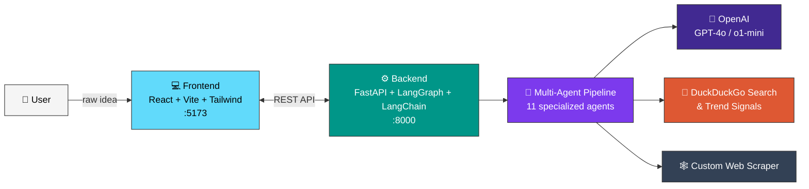
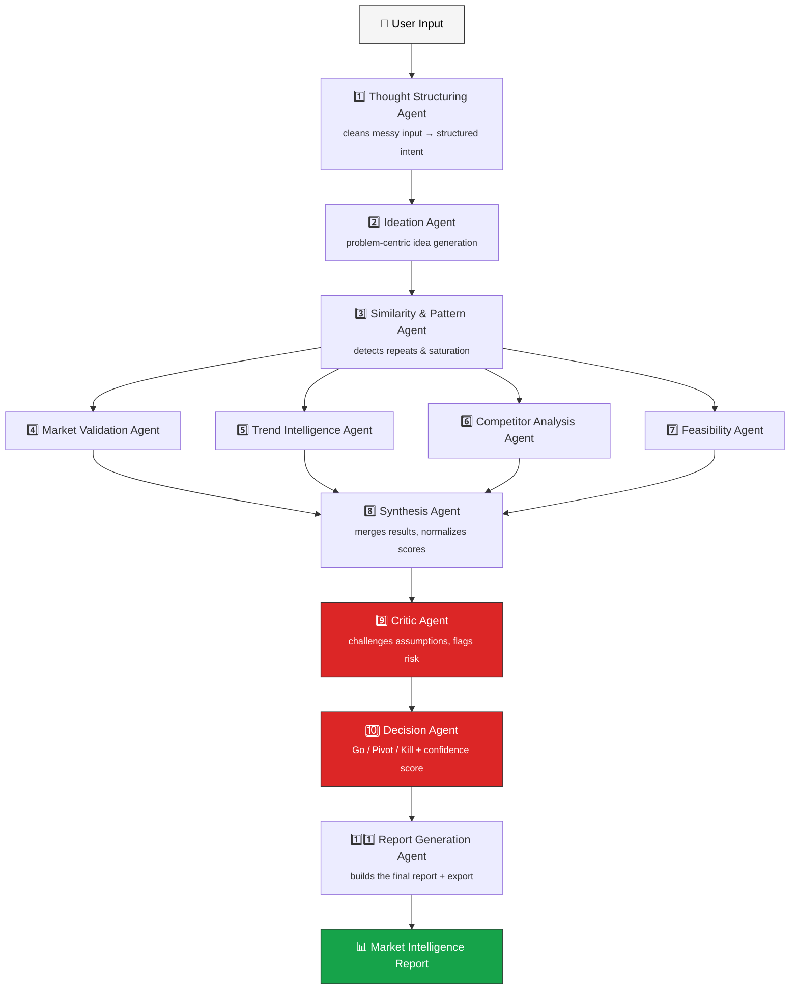

<div align="center">

# 🚀 CoFound.ai

### Your Autonomous AI Co-Founder

**Turn a messy idea into a market intelligence report — no manual research required.**

<p>
  
  
  
  
</p>
<p>
  
  
  
  
  
  
</p>

<p>
  <a href="#-overview">Overview</a> •
  <a href="#-features">Features</a> •
  <a href="#-architecture">Architecture</a> •
  <a href="#-the-agent-pipeline">Agent Pipeline</a> •
  <a href="#%EF%B8%8F-getting-started">Getting Started</a> •
  <a href="#-tech-stack">Tech Stack</a> •
  <a href="#%EF%B8%8F-roadmap">Roadmap</a>
</p>

</div>

<br/>

> [!TIP]
> **The one-liner:** *User triggers → Agents think → System decides → Report delivered.*
> You don't micromanage the research — the system runs autonomously, end-to-end.

<br/>

## 📖 Overview

**CoFound.ai** is an agentic platform that acts as your AI Co-Founder. Give it a raw, unstructured idea and **11 specialized agents** take over — researching the market, mapping competitors, hunting for gaps, and stress-testing your assumptions — before handing back a clear **Go / Pivot / Kill** verdict backed by a full intelligence report.

Built for solo founders, indie hackers, early-stage teams, and product leads who want a sharp second opinion before spending months building the wrong thing.

<br/>

## 🎯 Why CoFound.ai?

<table>
<tr>
<td width="50%" valign="top">

### ❌ The Problem

- Founders have fragmented ideas and no time for deep research
- Existing tools are static dashboards — you do all the digging
- Nothing challenges your assumptions or reasons end-to-end
- Teams jump into building *before* validating

</td>
<td width="50%" valign="top">

### ✅ The CoFound.ai Way

- One input, one autonomous pipeline, one clear verdict
- Agents actively research the live web, not stale training data
- A dedicated Critic Agent adversarially checks every claim
- You decide what **not** to build — before writing a line of code

</td>
</tr>
</table>

<br/>

## ✨ Features

| | | |
|:---:|---|---|
| 🧠 | **Autonomous Analysis** | Drop in an idea and 11 specialized agents — Ideation, Trend Intelligence, Competitor Analysis, Feasibility, Critic, Decision, and more — evaluate it end-to-end. |
| 🌐 | **Real-Time Research** | Agents actively search the web (DuckDuckGo, trend signals, community data) instead of relying on stale model knowledge. |
| 🔀 | **Stateful Graph Workflow** | Orchestrated with **LangGraph** — parallel research, then enforced sequential synthesis. Agents never talk over each other. |
| ⚖️ | **Adversarial Self-Critique** | A dedicated Critic Agent challenges assumptions and penalizes overconfidence before any decision is finalized. |
| 🎯 | **One Clear Verdict** | Every run ends in a single opinionated call — **Go / Pivot / Kill** — with rationale, confidence score, and next actions. |
| 🛠️ | **Manual Research Tools** | Sidebar utilities — Trend Explorer, Competitor Research, Market Gap Matrix — for when you want to dig in yourself. |

<br/>

## 🏗️ Architecture



<br/>

## 🧩 The Agent Pipeline

CoFound.ai runs a **deterministic execution graph**: one entry point, safe parallelism during research, a single critic + decision pass at the end. No chat loops, no agent democracy.



> [!NOTE]
> **Design principles:** one responsibility per agent · no agent talks to raw data directly · parallel execution only where safe · Critic and Decision each run exactly once — no retry loops, low cost, low hallucination risk.

<br/>

## 🖥️ Getting Started

### Prerequisites

| Requirement | Version |
|---|---|
| Python | 3.10+ |
| Node.js | 18+ |
| OpenAI API key | [Get one here](https://platform.openai.com/api-keys) |

### 1. Clone the repo

```bash
git clone https://github.com/harshadpy/cofound.git
cd cofound
```

### 2. Configure environment

Create a `.env` file in the project root:

```env
OPENAI_API_KEY=sk-your-key-here
```

### 3. Run the backend (API & Agents)

```bash
# Install dependencies
pip install -r requirements.txt

# Start the API server
python -m uvicorn api.main:app --host 0.0.0.0 --port 8000 --reload
```
➡️ API live at **`http://localhost:8000`**

### 4. Run the frontend (UI)

```bash
cd frontend
npm install
npm run dev
```
➡️ UI live at **`http://localhost:5173`**

### 5. Generate your first report

Open the app → drop in your raw idea → optionally add industry / geography / user segment → hit **Generate Market Intelligence** → let the agents do the rest.

<br/>

## 📂 Project Structure

```
cofound/
├── agents/              # 11 specialized agent implementations
├── api/                 # FastAPI routes & schemas
├── config/              # Model routing, thresholds, API config
├── frontend/            # React + Vite + Tailwind UI
├── tools/               # Search & scraping integrations
├── tests/               # Agent, tool, and workflow tests
├── utils/               # Shared helper functions
├── requirements.txt     # Python dependencies
├── render.yaml          # Deployment config (Render)
├── prd.md               # Full product requirements document
└── MASTER_REFERENCE.md  # Internal reference documentation
```

> 📘 See [`prd.md`](./prd.md) for the full product spec, UX architecture, and detailed agent I/O contracts.

<br/>

## 🧱 Tech Stack

<table>
<tr><th>Layer</th><th>Choice</th><th>Purpose</th></tr>
<tr><td>Frontend</td><td>React + Vite + TailwindCSS</td><td>Fast iteration, modern UX</td></tr>
<tr><td>Frontend State</td><td>Zustand</td><td>Lightweight global state</td></tr>
<tr><td>Backend API</td><td>FastAPI (Python)</td><td>Async, type-safe, agent-friendly</td></tr>
<tr><td>Orchestration</td><td>LangGraph + LangChain</td><td>Multi-agent execution graphs</td></tr>
<tr><td>Reasoning Models</td><td>OpenAI GPT-4o / o1-mini</td><td>Deep reasoning, critique, decisions</td></tr>
<tr><td>Fast Models</td><td>OpenAI o4-mini</td><td>Cheap, iterative reasoning for ideation/structuring</td></tr>
<tr><td>Embeddings</td><td>OpenAI <code>text-embedding-3-large</code></td><td>Idea clustering & similarity memory</td></tr>
<tr><td>Search</td><td>DuckDuckGo, custom scraper</td><td>Real-time market & demand signals</td></tr>
<tr><td>Deployment</td><td>Render (<code>render.yaml</code>)</td><td>One-click hosting</td></tr>
</table>

<br/>

## 🗺️ Roadmap

- [ ] Founder memory across multiple projects
- [ ] Investor-ready pitch deck export
- [ ] Multi-idea portfolio analysis
- [ ] Per-user agent fine-tuning
- [ ] Polished PDF / shareable export

<br/>

## 🤝 Contributing

Contributions, issues, and feature requests are welcome!

```bash
1. Fork the project
2. Create your feature branch   → git checkout -b feature/amazing-feature
3. Commit your changes          → git commit -m 'Add some amazing feature'
4. Push to the branch           → git push origin feature/amazing-feature
5. Open a Pull Request
```

<br/>

## 📄 License

Distributed under the **MIT License**. See [`LICENSE`](./LICENSE) for details.

---

<div align="center">

**Made with 🧠 by [harshadpy](https://github.com/harshadpy)**

⭐ *If CoFound.ai saved you from building the wrong thing, consider starring the repo!*

</div>
