<div align="center">

# 🚀 CoFound.ai

### Agentic AI Co-Founder & Autonomous Market Intelligence

**Turn raw, unstructured startup ideas into institutional-grade market intelligence dossiers — in minutes.**

<p>
  
  
  
  
  
</p>
<p>
  
  
  
  
  
  
  
  
</p>

<p align="center">
  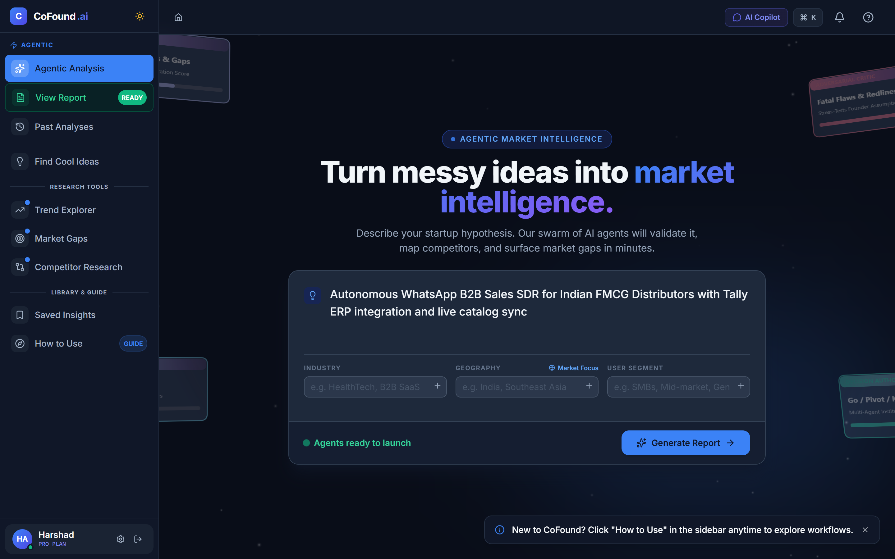
</p>

<p>
  <a href="#-overview">Overview</a> •
  <a href="#-visual-tour--screenshots">Visual Tour</a> •
  <a href="#-key-features">Key Features</a> •
  <a href="#-the-11-agent-swarm">The 11-Agent Swarm</a> •
  <a href="#-architecture">Architecture</a> •
  <a href="#-research-tools-suite">Research Tools</a> •
  <a href="#%EF%B8%8F-getting-started">Getting Started</a> •
  <a href="#-cloud--database-setup">Cloud & Supabase</a> •
  <a href="#-tech-stack">Tech Stack</a> •
  <a href="#-documentation">Documentation</a> •
  <a href="#%EF%B8%8F-roadmap">Roadmap</a>
</p>

</div>

<br/>

> [!TIP]
> **The Core Thesis:** *User triggers → 11 Agentic Workers Investigate → Adversary Challenges → Consensus Reached → Institutional Dossier Delivered.*
> You never micromanage tedious research — CoFound.ai executes deep market diligence autonomously, end-to-end.

<br/>

## 📖 Overview

**CoFound.ai** is an agentic venture evaluation platform that acts as your AI Co-Founder. Drop in a raw, napkin-sketch startup concept and **11 specialized agentic workers** orchestrate in parallel — scraping the live web, quantifying total addressable markets (TAM), mapping competitor moats, validating customer willingness-to-pay, and running adversarial red-team critique.

Within minutes, CoFound.ai delivers an institutional-grade **Go / Pivot / Kill** verdict backed by unit economics, fatal risk analysis, and actionable next steps.

---

## 📸 Visual Tour & System Screenshots

Explore the complete CoFound.ai platform — from initial concept intake to real-time multi-agent swarm execution, institutional dossier synthesis, and deep quantitative diligence tooling.

### 1. Interactive 3D Hero & Hypothesis Workbench
Drop in napkin-sketch ideas with instant industry, geography, and target customer tags. Features a dynamic ambient Three.js parallax starfield.
<p align="center">
  
</p>

---

### 2. Autonomous 11-Agent Swarm in Execution
Watch the 11 specialized agent workers investigate across live web intelligence, technical feasibility, and TAM modeling in parallel with real-time SSE streaming telemetry.
<p align="center">
  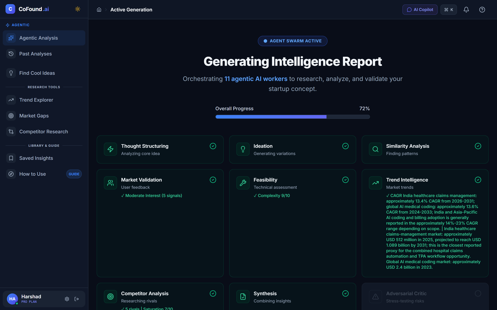
</p>

---

### 3. Institutional Market Intelligence Dossier
Definitive **Go / Pivot / Kill** decision authority with numeric confidence scores, survival probability, strategic reasoning, and structured 5-stage milestone next steps.
<p align="center">
  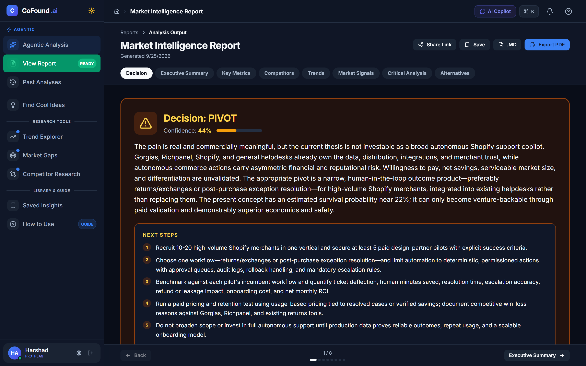
</p>

---

### 4. Financial Unit Economics & Quantitative Sizing
Automated parsing of unstructured market research into concrete financial indicators: Market Saturation, TAM sizing, projected CAGR rates, user demand signals, and feasibility indices.
<p align="center">
  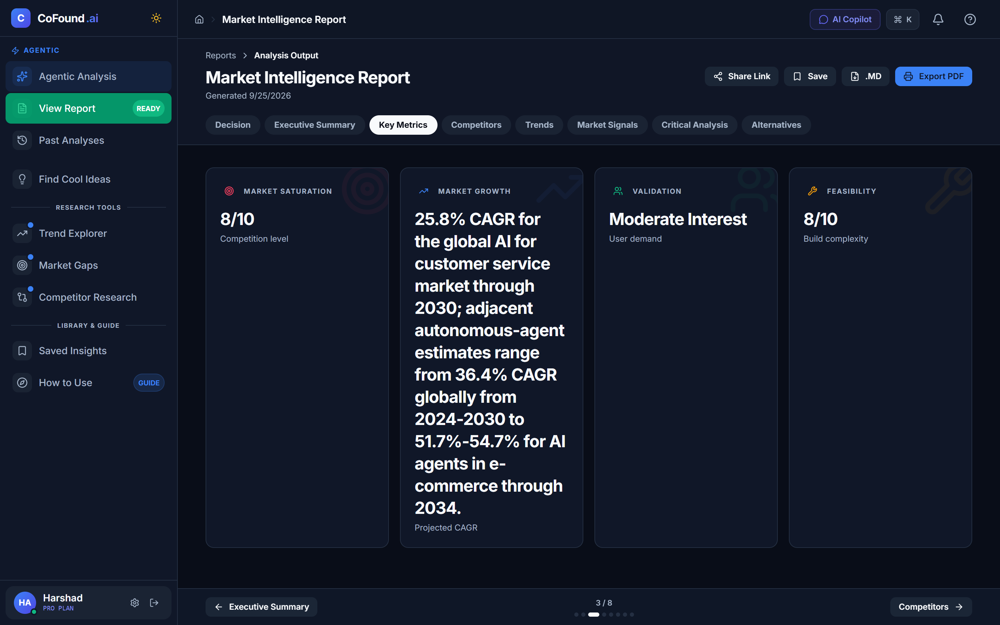
</p>

---

### 5. Competitor Dynamics & Saturation Matrix
Real-time competitor mapping with 10-tier Saturation Scores, funding badges, verified web domains, team estimates, and direct strengths vs. vulnerability breakdowns.
<p align="center">
  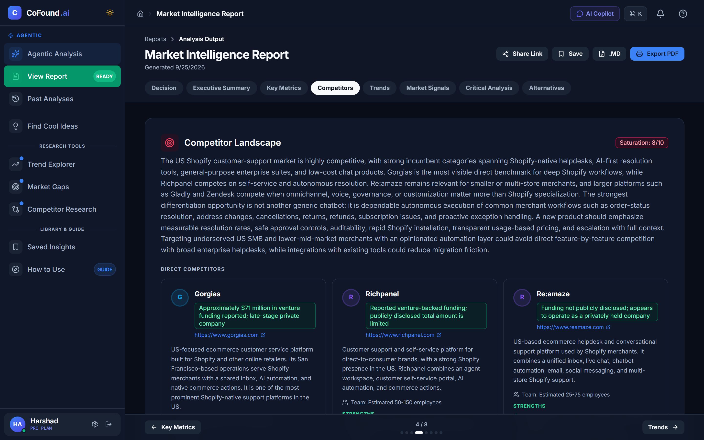
</p>

---

### 6. Quantitative Trend Explorer (`/trends`)
Institutional quantitative market parser breaking down narrative web data into headline figures (`$202.9M TAM`, `25.8% - 54.7% CAGR`), subsector growth dynamics, and core growth catalysts.
<p align="center">
  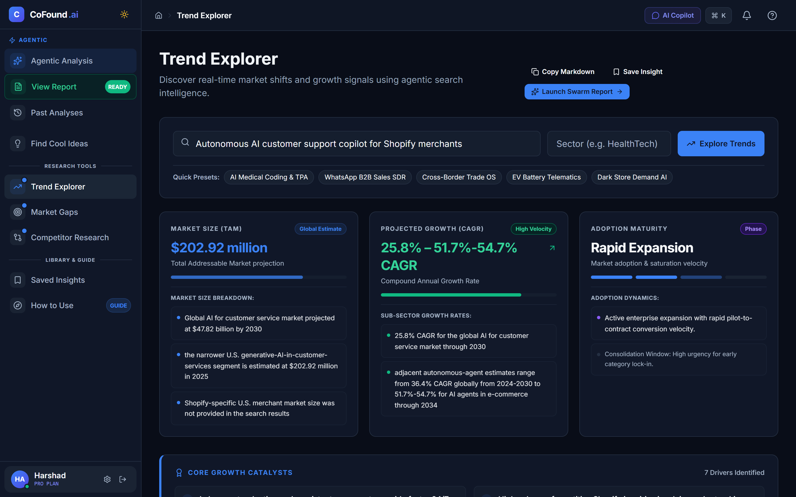
</p>

---

### 7. Customer Friction Signals & Willingness to Pay (`/market-gaps`)
Surfaces verified voice-of-customer pain points, sentiment meters, and customer Willingness to Pay (WTP) extracted directly from forum discussions, complaints, and user reviews.
<p align="center">
  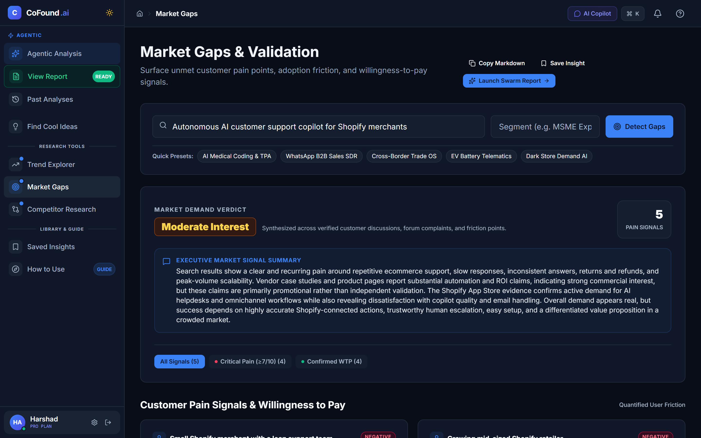
</p>

---

### 8. Idea Brainstorming, Wedges & Contrarian Pivots (`/brainstorm`)
AI-driven concept expansion featuring initial wedge formulation, monetization structures, and contrarian pivot architectures to de-risk red-ocean ideas.
<p align="center">
  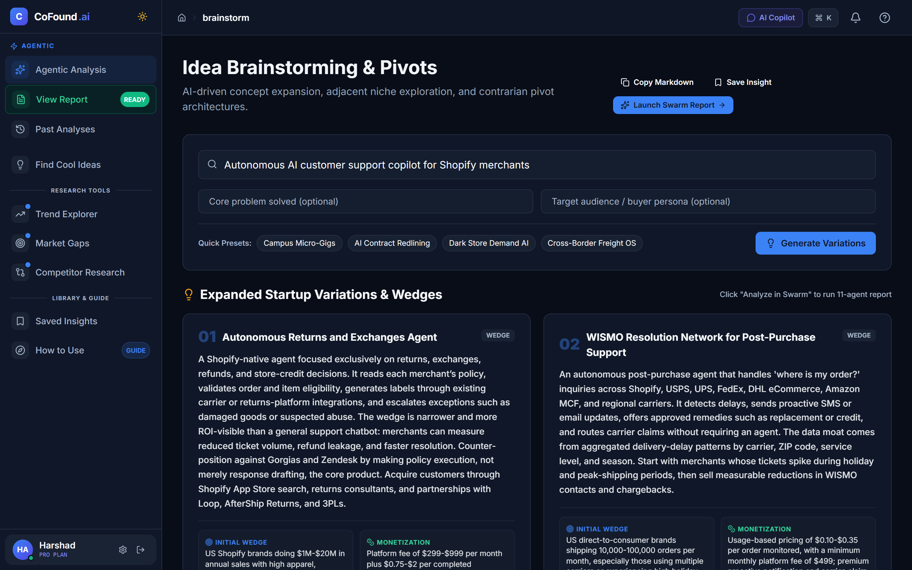
</p>

---

### 9. Curated Problem & Hypothesis Library (`/ideas`)
Pre-validated problem statements across B2B SaaS, FinTech, HealthTech, and CleanTech. 1-click evaluation triggers launch deep agentic investigations immediately.
<p align="center">
  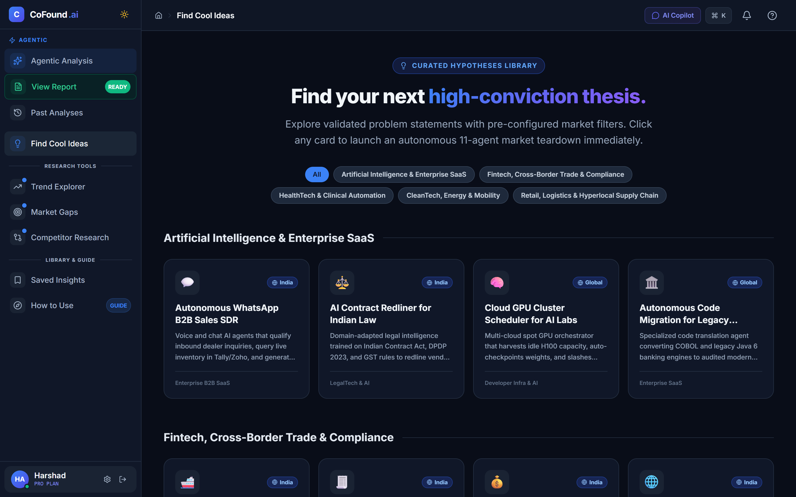
</p>

---

### 10. Grounded Executive AI Copilot (`Cmd/Ctrl + K`)
Slide-out strategic partner grounded in active report findings. Ask follow-up questions, simulate VC partner pushback, or request wedge recommendations on demand.
<p align="center">
  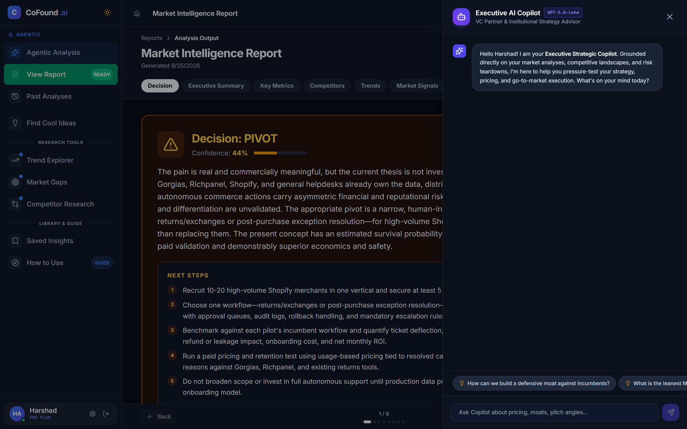
</p>

---

### 11. Local SQLite Analysis Archive & Verdict Filter (`/history`)
Persistent local analysis library with instant keyword search, verdict filters (`ALL`, `GO`, `PIVOT`, `KILL`), and 1-click iteration or resume capabilities.
<p align="center">
  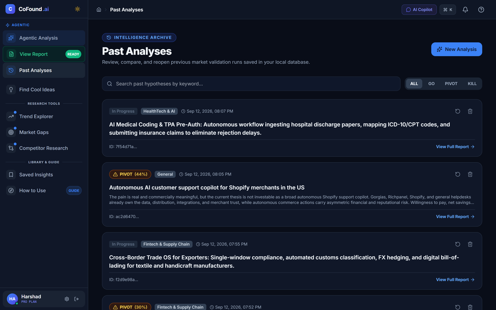
</p>

---

## ✨ Key Features

### 🤖 11-Agent Parallel Swarm
- **Deterministic Orchestration**: Powered by **LangGraph** with a directed acyclic graph (DAG) topology — parallel research workers with sequential synthesis and adversarial evaluation.
- **Real-Time Live Web Intelligence**: Powered by **Tavily AI & DuckDuckGo Search** to evaluate live market trends, real pricing, and recent competitors rather than stale model weights.
- **Adversarial Red-Teaming**: A dedicated Critic Agent stress-tests founder assumptions, penalizes overconfidence, and surfaces fatal kill conditions.
- **Clear Go / Pivot / Kill Verdict**: Definitive institutional decisioning with numeric confidence scores, financial unit economics, and 30-60-90 day milestone plans.

### 💬 Grounded AI Copilot
- **Live Context-Aware Drawer**: Slide-out assistant (`Cmd/Ctrl + K` or top bar) grounded in your active startup hypothesis and multi-agent report findings.
- **Executive Actions**: Instant 1-click prompts for "Suggest 3 Wedges", "Draft 30-sec Elevator Pitch", "Simulate VC Pushback", and "Unit Economics Check".

### 📊 Institutional Research Tools Suite
- **Trend Explorer (`/trends`)**: Bloomberg/PitchBook-grade quantitative parser breaking down narrative market data into crisp headline figures (`USD 4.5B`, `18% CAGR ↗`) with granular sub-sector micro-cards.
- **Market Gaps & Validation (`/gaps`)**: Real-time customer friction signals, voice-of-customer verbatim quotes, severity progress meters, and Willingness to Pay (WTP) metrics.
- **Competitor Analysis (`/competitors`)**: 10-tier Market Saturation Index, Competitive Dynamics Summary, and rival cards with headquarters, funding badges, and moat vs. vulnerability breakdowns.
- **Idea Brainstorming & Pivots (`/brainstorm`)**: AI-driven concept expansion with structured Initial Wedge & Monetization cards, plus contrarian pivot architectures.
- **Curated Problem Library (`/ideas`)**: Pre-validated problem statements across B2B SaaS, HealthTech, FinTech, CleanTech, and Quick Commerce.

### ☁️ Supabase Cloud & Persistence
- **Cloud Database**: Persistent storage for public shared reports, user profiles, and platform notifications.
- **Public Report Sharing (`/share/:id`)**: One-click public URLs for pitching investors, co-founders, or advisors.
- **BYOK (Bring-Your-Own-Key) Vault**: Secure per-user API key management for custom OpenAI and Tavily keys stored in Supabase.
- **Real-time Notifications**: Instant alert feed with unread badges and direct link routing.
- **Local History (`/history`)**: Local SQLite persistence with search, verdict filters (`ALL`, `GO`, `PIVOT`, `KILL`), and 1-click iteration.

### 📄 Professional Export & Guardrails
- **Print & PDF Export**: Executive print stylesheet with dedicated cover page, institutional verdict badges, and page-break rules for clean PDF export.
- **1-Click Markdown (.md) Export**: Download complete dossier for local documentation or Notion/Obsidian import.
- **Hallucination Guardrails**: Automated competitor grounding engine that cross-references extracted URLs and company names against search text to eliminate synthetic domains.

<br/>

## 🏗️ Architecture

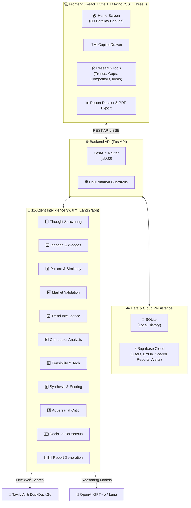

<br/>

## 🧩 The 11-Agent Swarm Pipeline

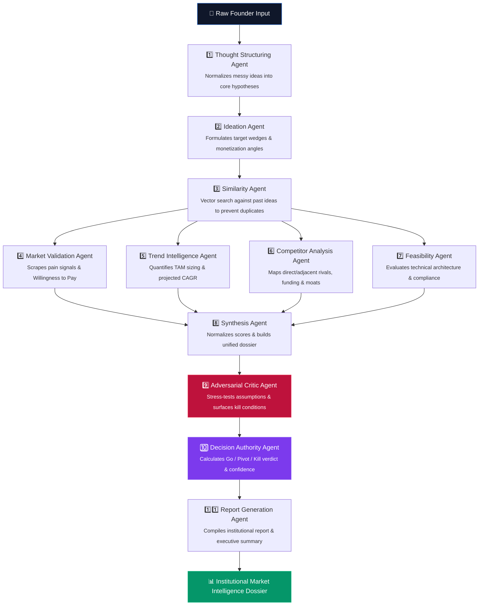

<br/>

## 🖥️ Getting Started

### Prerequisites

| Requirement | Version | Notes |
|---|---|---|
| Python | 3.11+ | Backend API & agent pipelines |
| Node.js | 18+ | Frontend client (React + Vite) |
| OpenAI API Key | Required | Deep reasoning & critique |
| Tavily API Key | Recommended | High-speed real-time web search |
| Supabase Project | Optional | Cloud sync, BYOK, and shared reports |

---

### 1. Clone the Repository

```bash
git clone https://github.com/harshadpy/cofound.git
cd cofound
```

### 2. Configure Environment

Create a `.env` file in the project root:

```env
# Core LLM
OPENAI_API_KEY=sk-your-openai-key-here
MODEL_PRIMARY=gpt-4o
MODEL_FAST=gpt-4o-mini

# Search & Research
TAVILY_API_KEY=tvly-your-tavily-key-here

# Supabase Cloud (Optional for sharing & cloud sync)
SUPABASE_URL=https://your-project.supabase.co
SUPABASE_KEY=your-supabase-anon-or-service-key

# LangSmith Observability (Optional)
LANGCHAIN_TRACING_V2=false
LANGCHAIN_API_KEY=
```

### 3. Run the Backend API

```bash
# Install Python dependencies
pip install -r requirements.txt

# Start FastAPI server with live reload
python -m uvicorn api.main:app --host 0.0.0.0 --port 8000 --reload
```
➡️ Backend live at: **`http://localhost:8000`** (Docs at `/docs`)

### 4. Run the Frontend Client

```bash
cd frontend
npm install
npm run dev
```
➡️ Frontend UI live at: **`http://localhost:5173`**

<br/>

## ☁️ Cloud & Database Setup

CoFound.ai runs fully offline with local SQLite for development, and seamlessly connects to **Supabase** for cloud collaboration:

### Supabase Schema
The following tables power cloud features:
1. `users`: Stores user profile details, plans, and encrypted BYOK API keys.
2. `shared_reports`: Stores immutable public report snapshots with unique UUIDs.
3. `notifications`: Real-time system and analysis alerts.

<br/>

## 🧱 Tech Stack

<table>
<tr><th>Domain</th><th>Technology</th><th>Role</th></tr>
<tr><td><b>Frontend Client</b></td><td>React 19, Vite, TailwindCSS</td><td>High-performance responsive UI</td></tr>
<tr><td><b>Interactive 3D</b></td><td>Three.js</td><td>Dynamic ambient parallax background</td></tr>
<tr><td><b>State Management</b></td><td>Zustand</td><td>Lightweight synchronized application state</td></tr>
<tr><td><b>Backend Server</b></td><td>FastAPI (Python 3.11+)</td><td>Async endpoints, SSE streaming, REST API</td></tr>
<tr><td><b>Agent Orchestration</b></td><td>LangGraph & LangChain</td><td>Deterministic state graph with 11 parallel workers</td></tr>
<tr><td><b>AI Models</b></td><td>OpenAI GPT-4o / GPT-4o-mini</td><td>Multi-perspective reasoning, critique & consensus</td></tr>
<tr><td><b>Search Intelligence</b></td><td>Tavily AI, DuckDuckGo</td><td>Real-time web scraping & competitive verification</td></tr>
<tr><td><b>Cloud Storage</b></td><td>Supabase (PostgreSQL)</td><td>BYOK vault, public reports, and alerts</td></tr>
<tr><td><b>Local Storage</b></td><td>SQLite</td><td>Fast local runs and analysis history</td></tr>
</table>

<br/>

## 📚 Documentation

Comprehensive architectural blueprints, specifications, and reference manuals are organized in the [`docs/`](./docs) directory:

- [**Product Requirements Document (PRD)**](./docs/prd.md) — Core principles, feature requirements, and agent specifications
- [**Master Architecture & Reference**](./docs/reference.md) — System execution graph, deep architectural decisions, and agent definitions
- [**Product & UI Architecture Overview**](./docs/app_overview.md) — Concise summary of page structure, UI language, and value proposition
- [**UI Modernization Specification**](./docs/designmodernization.md) — Design system rules, typography scale, color tokens, and craft standards
- [**Project State & Context Memory**](./docs/context.md) — Technical state, milestones, and engineering onboarding reference

<br/>

## 🗺️ Roadmap

- [x] Autonomous 11-agent parallel research graph
- [x] Real-time live web intelligence (Tavily AI + DDG)
- [x] Interactive 3D Three.js Parallax Canvas
- [x] Executive AI Copilot grounded on active reports
- [x] Institutional Quantitative Research Suite (Trends, Gaps, Competitors, Ideas)
- [x] Supabase cloud persistence & BYOK custom keys
- [x] Public report sharing (`/share/:id`)
- [x] Multi-page print & PDF export engine
- [x] Hallucination & grounding verification guardrails
- [ ] Multi-idea portfolio matrix & comparative analysis
- [ ] Automated Pitch Deck generator (slide outline + visuals)
- [ ] Automated competitor change radar & recurring email digests

<br/>

## 🤝 Contributing

Contributions, feature suggestions, and bug reports are welcome!

```bash
1. Fork the Project
2. Create a Feature Branch  (git checkout -b feature/AmazingFeature)
3. Commit your Changes     (git commit -m 'Add AmazingFeature')
4. Push to the Branch      (git push origin feature/AmazingFeature)
5. Open a Pull Request
```

<br/>

## 📄 License

Distributed under the **MIT License**. See [`LICENSE`](./LICENSE) for details.

---

<div align="center">

**Crafted with 🧠 for visionary founders and builders.**

⭐ *If CoFound.ai helped you evaluate your next venture, star the repository!*

</div>
